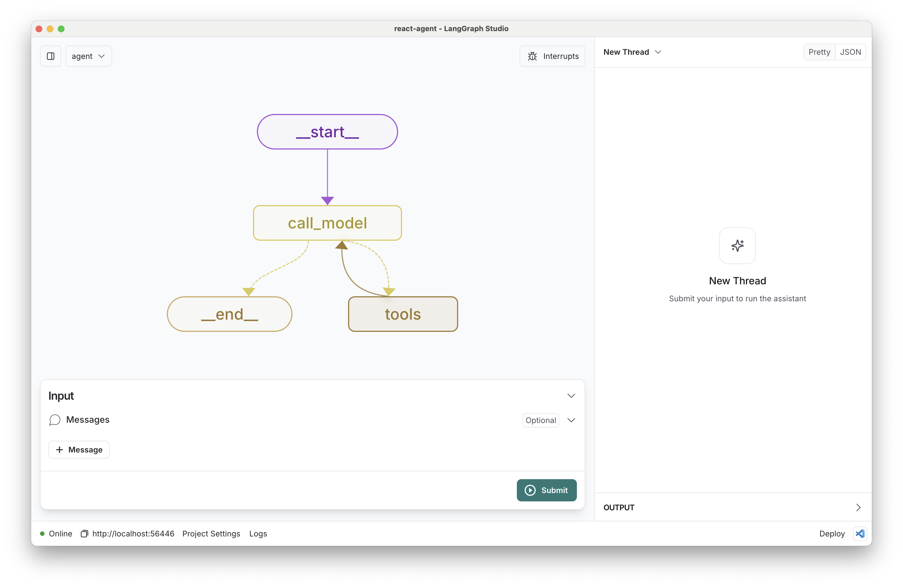

# LangGraph Layered Multi-Agent System

[![Open in - LangGraph Studio](https://img.shields.io/badge/Open_in-LangGraph_Studio-00324d.svg?logo=data:image/svg%2bxml;base64,PHN2ZyB4bWxucz0iaHR0cDovL3d3dy53My5vcmcvMjAwMC9zdmciIHdpZHRoPSI4NS4zMzMiIGhlaWdodD0iODUuMzMzIiB2ZXJzaW9uPSIxLjAiIHZpZXdCb3g9IjAgMCA2NCA2NCI+PHBhdGggZD0iTTEzIDcuOGMtNi4zIDMuMS03LjEgNi4zLTYuOCAyNS43LjQgMjQuNi4zIDI0LjUgMjUuOSAyNC41QzU3LjUgNTggNTggNTcuNSA1OCAzMi4zIDU4IDcuMyA1Ni43IDYgMzIgNmMtMTIuOCAwLTE2LjEuMy0xOSAxLjhtMzcuNiAxNi42YzIuOCAyLjggMy40IDQuMiAzLjQgNy42cy0uNiA0LjgtMy40IDcuNkw0Ny4yIDQzSDE2LjhsLTMuNC0zLjRjLTQuOC00LjgtNC44LTEwLjQgMC0xNS4ybDMuNC0zLjRoMzAuNHoiLz48cGF0aCBkPSJNMTguOSAyNS42Yy0xLjEgMS4zLTEgMS43LjQgMi41LjkuNiAxLjcgMS44IDEuNyAyLjcgMCAxIC43IDIuOCAxLjYgNC4xIDEuNCAxLjkgMS40IDIuNS4zIDMuMi0xIC42LS42LjkgMS40LjkgMS41IDAgMi43LS41IDIuNy0xIDAtLjYgMS4xLS44IDIuNi0uNGwyLjYuNy0xLjgtMi45Yy01LjktOS4zLTkuNC0xMi4zLTExLjUtOS44TTM5IDI2YzAgMS4xLS45IDIuNS0yIDMuMi0yLjQgMS41LTIuNiAzLjQtLjUgNC4yLjguMyAyIDEuNyAyLjUgMy4xLjYgMS41IDEuNCAyLjMgMiAyIDEuNS0uOSAxLjItMy41LS40LTMuNS0yLjEgMC0yLjgtMi44LS44LTMuMyAxLjYtLjQgMS42LS41IDAtLjYtMS4xLS4xLTEuNS0uNi0xLjItMS42LjctMS43IDMuMy0yLjEgMy41LS41LjEuNS4yIDEuNi4zIDIuMiAwIC43LjkgMS40IDEuOSAxLjYgMi4xLjQgMi4zLTIuMy4yLTMuMi0uOC0uMy0yLTEuNy0yLjUtMy4xLTEuMS0zLTMtMy4zLTMtLjUiLz48L3N2Zz4=)](https://langgraph-studio.vercel.app/templates/open?githubUrl=https://github.com/langchain-ai/react-agent)

This repository is a layered multi-agent orchestration system built on [LangGraph](https://github.com/langchain-ai/langgraph) `StateGraph`. The current runtime entrypoint is `langgraph.json -> src/react_agent/graph.py:graph`, and the mainline repo scope centers on `src/react_agent/`, `config/agents/`, and the supporting regression / training / observability tooling.

## Current Engineering Snapshot

- Runtime entry: `langgraph.json -> src/react_agent/graph.py:graph`
- Main runtime chain: `router_node -> manager_broadcast -> agent nodes -> manager_summary -> (_run_final_summary / finalize_summary) -> optional memory_update -> __end__`
- a01 contract role: `a01_cio_orchestrator` can emit a contract, but Manager only consumes it after runtime validation; otherwise dispatch falls back to normal assignment templates.
- Optional capabilities boundary: `thread_summary`, `messages window`, `results pools`, `stable consume`, and `checkpointer` are env-gated features, not default-always-on behavior.
- Current stage: the repo is closer to `structure-stable` than `quality-stable`; runtime structure and protocol closure are stronger than environment, training, and documentation closure.

## Quickstart (30s)

1) Create env file:
   - Bash: `cp .env.example .env`
   - PowerShell: `Copy-Item .env.example .env`
2) Run minimal demo: `conda run -n cline_env python demo_layered_run.py`
3) (Optional, Windows recommended) Run unit tests: `conda run --no-capture-output -n cline_env python -m pytest tests/unit_tests/`

Docs:
- [Project Overview](docs/PROJECT_OVERVIEW.md): current engineering snapshot and reusable short project description
- [SYSTEM_MAP](docs/SYSTEM_MAP.md): runtime / benchmark / training / eval command source
- [Docs Index](docs/INDEX.md): document authority map and reading order

If narrative wording conflicts with runtime behavior, prefer `src/react_agent/*`, focused tests, and the S0 docs referenced from `docs/INDEX.md`.

## Environment Baseline (Local/Codex)

- Python requirement: `>=3.11,<4.0` (from `pyproject.toml`).
- Official local environment: conda env `cline_env`.
- Do not use bare `python` as a validation entrypoint. On this machine it can fall back to system Python 3.7 and cause false failures.

Interpreter self-check:
- `conda run -n cline_env python --version`
- `conda run -n cline_env python -c "import sys; print(sys.executable)"`

Minimal import smoke (placeholder key only, do not commit real keys):
- PowerShell: `$env:TAVILY_API_KEY="test-key"; conda run -n cline_env python -c "from react_agent import graph_app; print(graph_app is not None)"`

Windows pytest execution note:
- Recommended command uses `--no-capture-output` to avoid conda output re-encoding (`UnicodeEncodeError(gbk)` in `conda run` capture path).
- This is an execution-layer workaround, not a project logic fix.
- Verification-only fallback (do not treat as new baseline): `D:\AnacondaEnvs\cline_env\python.exe -m pytest tests/unit_tests/`

## Repository Focus (Mainline Snapshot)

- Mainline runtime scope: `src/react_agent/`, `config/agents/`, `langgraph.json`, `pyproject.toml`, `react_agent/`, `sitecustomize.py`.
- Offline data-pipeline scripts are grouped under `ops/data_pipeline/`.
- Archived non-mainline docs/materials are grouped under `docs/archive/` and `assets/reference/`.
- When collaborating on runtime changes, prioritize the mainline scope + S0 docs from `docs/INDEX.md`.

## How to customize

1. **Add new tools**: Extend the agent's capabilities by adding new tools in [tools.py](./src/react_agent/tools.py). These can be any Python functions that perform specific tasks.
2. **Select a different model**: We default to `deepseek/deepseek-chat`. You can select a compatible chat model using `provider/model-name` via runtime context. Example: `openai/gpt-4-turbo-preview`.
3. **Customize the prompt**: We provide a default system prompt in [prompts.py](./src/react_agent/prompts.py). You can easily update this via context in the studio.

You can also extend the current runtime by:

- Modifying the agent's reasoning process in [graph.py](./src/react_agent/graph.py).
- Adjusting the ReAct loop or adding additional steps to the agent's decision-making process.

## Development

While iterating on your graph, you can edit past state and rerun your app from past states to debug specific nodes. Local changes will be automatically applied via hot reload. Try adding an interrupt before the agent calls tools, updating the default system message in `src/react_agent/context.py` to take on a persona, or adding additional nodes and edges!

Follow up requests will be appended to the same thread. You can create an entirely new thread, clearing previous history, using the `+` button in the top right.

You can find the latest (under construction) docs on [LangGraph](https://github.com/langchain-ai/langgraph) here, including examples and other references. Using those guides can help you pick the right patterns to adapt here for your use case.

[^1]: https://python.langchain.com/docs/concepts/#tools
