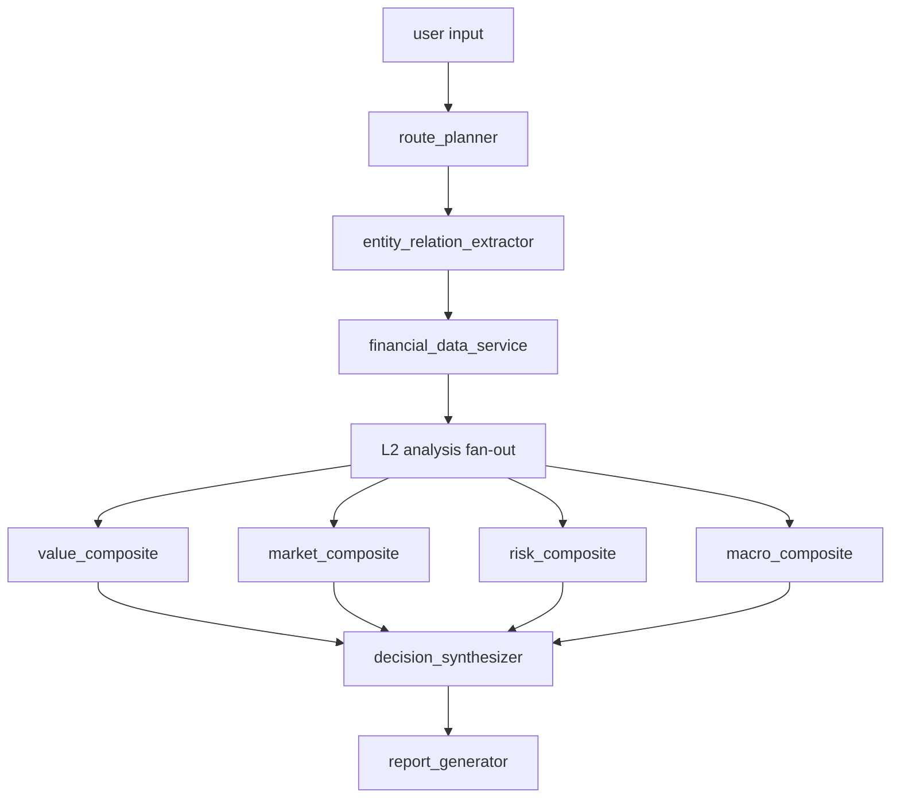

# Fixed DAG Architecture

This document describes the target architecture for the reset branch. It is not proof that the current runtime already executes this DAG.

## Target Agent Layers

| agent_id | layer | dimension | role |
| --- | --- | --- | --- |
| route_planner | L1 | parse | task route planning |
| financial_data_service | L1 | parse | financial data preparation |
| entity_relation_extractor | L1 | parse | entity and relation extraction |
| value_traditional_valuation | L2 | value | traditional company valuation |
| value_ml_valuation | L2 | value | machine learning valuation |
| value_meta_valuation | L2 | value | meta learning valuation |
| value_financial_analysis | L2 | value | company financial analysis |
| value_research_synthesis | L2 | value | analyst research synthesis |
| market_stock_technical | L2 | market | stock technical analysis |
| market_fund_manager_behavior | L2 | market | fund manager behavior analysis |
| market_ipo_investor_behavior | L2 | market | IPO investor behavior analysis |
| market_capital_flow_chip | L2 | market | capital flow and chip analysis |
| risk_crash | L2 | risk | crash risk analysis |
| risk_financial_fraud | L2 | risk | financial fraud risk analysis |
| risk_identification | L2 | risk | risk identification |
| risk_compliance_review | L2 | risk | disclosure compliance review |
| macro_analysis | L2 | macro | macro analysis |
| macro_commodity_pricing | L2 | macro | commodity pricing analysis |
| macro_index_valuation | L2 | macro | stock index valuation |
| macro_sentiment | L2 | macro | macro sentiment sensing |
| macro_industry_hotspot | L2 | macro | industry hotspot detection |
| sentiment_company_radar | L2 | sentiment_cross_cutting | company sentiment radar |
| value_composite | L3 | value | value dimension composite |
| market_composite | L3 | market | market dimension composite |
| risk_composite | L3 | risk | risk dimension composite |
| macro_composite | L3 | macro | macro dimension composite |
| decision_synthesizer | L4 | report | integrated decision synthesis |
| report_generator | L4 | report | final report generation |

## Topological Flow

## Execution Principles

- The DAG executor is infrastructure and is not counted as one of the 28 formal agents.
- Monitoring, health checks, and dashboards are not DAG agents.
- L1 prepares the plan, entities, relations, and financial data bundle.
- L2 produces dimension-specific analysis artifacts.
- L3 uses LLM plus deterministic functions to build dimension composites.
- L4 synthesizes a decision object and renders the report.
- Public output remains a single assistant answer.
