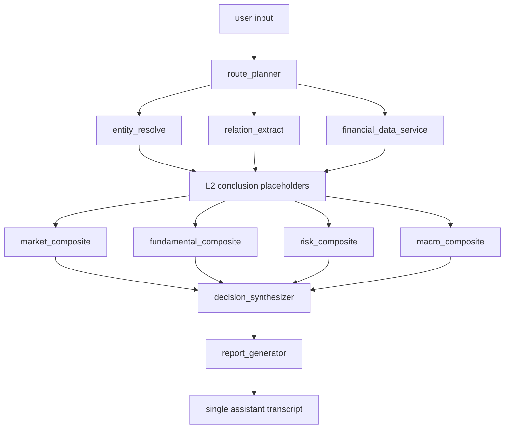

# Fixed DAG Architecture

This document describes the active Phase R1-B reset skeleton. The skeleton is
deterministic and provider-free. It is not a completed business analysis engine.

## Active Skeleton Flow

`route_planner` is the planner node and is not counted in the 28 target ids.

## Target IDs

| target_id | runtime layer | dimension | role |
| --- | --- | --- | --- |
| entity_resolve | L1 | evidence | entity resolution seam |
| relation_extract | L1 | evidence | relation extraction seam |
| financial_data_service | L1 | evidence | financial data bundle seam |
| financial_metrics_analyzer | L2 | fundamental | normalized financial metrics conclusion |
| stock_technical_analyst | L2 | market | stock technical conclusion |
| market_sentiment_analyst | L2 | market | market sentiment conclusion |
| news_event_analyst | L2 | macro | news and event conclusion |
| macro_policy_analyst | L2 | macro | macro policy conclusion |
| industry_trend_analyst | L2 | macro | industry trend conclusion |
| company_fundamental_analyst | L2 | fundamental | company fundamental conclusion |
| earnings_quality_analyst | L2 | fundamental | earnings quality conclusion |
| valuation_model_analyst | L2 | fundamental | valuation model conclusion |
| capital_flow_analyst | L2 | market | capital flow conclusion |
| shareholder_structure_analyst | L2 | macro | shareholder structure conclusion |
| insider_transaction_analyst | L2 | macro | insider transaction conclusion |
| credit_risk_analyst | L2 | risk | credit risk conclusion |
| regulatory_compliance_analyst | L2 | risk | regulatory compliance conclusion |
| esg_risk_analyst | L2 | risk | ESG risk conclusion |
| supply_chain_risk_analyst | L2 | risk | supply chain risk conclusion |
| competitive_position_analyst | L2 | fundamental | competitive position conclusion |
| scenario_stress_analyst | L2 | risk | scenario stress conclusion |
| sentiment_company_radar | L2 | cross_cutting | company sentiment conclusion |
| market_composite | L3 | market | market dimension composite |
| fundamental_composite | L3 | fundamental | fundamental dimension composite |
| risk_composite | L3 | risk | risk dimension composite |
| macro_composite | L3 | macro | macro dimension composite |
| decision_synthesizer | L4 | decision | integrated decision placeholder |
| report_generator | L4 | report | final report placeholder |

The company sentiment radar output routes are `market_composite` and
`risk_composite`.

## Execution Principles

- The DAG executor is infrastructure and is not counted as a target id.
- L1 prepares the plan, entities, relations, and financial data bundle.
- L2 produces normalized conclusion objects.
- L3 produces deterministic dimension composite placeholders.
- L4 produces a deterministic decision placeholder and report placeholder.
- Public output remains a single assistant answer.
- R1-B placeholders use `status=pending_implementation` until real business
  implementations replace them.
