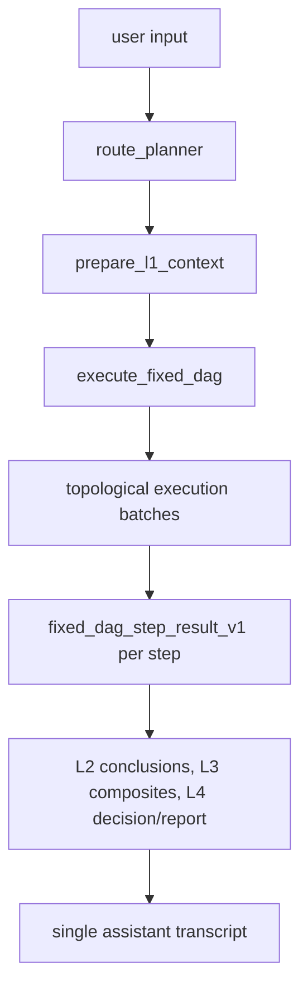

# Fixed DAG Architecture

This document describes the active reset skeleton, the Phase R4-A fixed DAG
catalog source, the Phase R4-B runtime binding registry, the Phase R4-C legacy
registry boundary cleanup, the Phase R5-B1 frontend contract migration, and the
Phase R5-B2 workflow DAG inspector UI rewrite, the Phase R8-1 selected routing
contract foundation, the Phase R8-2 deterministic selected DAG compiler, and
the Phase R8-3 route-intent planner seam.
The skeleton is deterministic, provider-free, plan-driven, and backed by
explicit catalog, binding, contract, executor, and function seams. It is not a
completed business analysis engine.

## Active Skeleton Flow

The formal reset roster has 27 agent ids. The DAG executor itself is
infrastructure and is not counted as an agent id.

The active catalog source is `config/fixed_dag/agent_catalog.json`, loaded and
validated by `src/react_agent/fixed_dag_catalog.py`. The source workbook
`新架构_固定DAG_最终分层级智能体表_v4_反馈修正版.xlsx` is retained as the
R4 baseline input.

The active runtime binding source is `config/fixed_dag/runtime_bindings.json`,
loaded and validated by `src/react_agent/fixed_dag_runtime_registry.py`. It maps
the same 27 target ids to deterministic seams, disabled external HTTP
candidates, or pending placeholders. The binding registry does not change the
DAG topology and does not enable external invocation.

## Target IDs

| target_id | runtime layer | dimension | role |
| --- | --- | --- | --- |
| route_planner | L1 | planning | fixed DAG plan seam |
| financial_data_service | L1 | evidence | financial data bundle seam |
| entity_relation_extractor | L1 | evidence | entity and relation extraction seam |
| value_traditional_valuation | L2 | value | traditional valuation conclusion |
| value_ml_valuation | L2 | value | ML valuation conclusion |
| value_meta_valuation | L2 | value | meta valuation conclusion |
| value_research_synthesis | L2 | value | analyst research synthesis conclusion |
| market_stock_technical | L2 | market | stock technical conclusion |
| market_fund_manager_behavior | L2 | market | fund manager behavior conclusion |
| market_ipo_investor_behavior | L2 | market | IPO investor behavior conclusion |
| market_capital_flow_chip | L2 | market | capital flow and chip conclusion |
| sentiment_company_radar | L2 | market | company sentiment conclusion |
| risk_crash | L2 | risk | crash risk conclusion |
| risk_financial_fraud | L2 | risk | financial fraud risk conclusion |
| risk_identification | L2 | risk | risk identification conclusion |
| risk_compliance_review | L2 | risk | compliance review conclusion |
| macro_analysis | L2 | macro | macro analysis conclusion |
| macro_commodity_pricing | L2 | macro | commodity pricing conclusion |
| macro_index_valuation | L2 | macro | index valuation conclusion |
| macro_sentiment | L2 | macro | macro sentiment conclusion |
| macro_industry_hotspot | L2 | macro | industry hotspot conclusion |
| value_composite | L3 | value | value dimension composite |
| market_composite | L3 | market | market dimension composite |
| risk_composite | L3 | risk | risk dimension composite |
| macro_composite | L3 | macro | macro dimension composite |
| decision_synthesizer | L4 | decision | integrated decision placeholder |
| report_generator | L4 | report | final report placeholder |

The company sentiment radar output route is `market_composite` only. Generic
event flags may still exist in conclusion contracts, but the radar is not a
direct `risk_composite` input in this v4 feedback-aligned roster.

## Execution Principles

- The DAG executor is infrastructure and is not counted as a target id.
- `fixed_dag_agent_catalog_v1` is the active roster/catalog source for reset
  backend projection.
- `fixed_dag_runtime_bindings_v1` is the active backend runtime binding
  metadata source. Catalog ids, runtime binding ids, and executor step agent ids
  must match exactly.
- `fixed_dag_plan_v1.dag_steps[].depends_on` is the executor input.
- `validate_dag_steps` checks unique ids, dependency existence, acyclicity,
  stage/dimension legality, roster membership, and dimension dependency rules.
- `topological_batches` groups ready steps into deterministic
  `execution_batches`.
- Each walked step records a `fixed_dag_step_result_v1` placeholder annotated
  with binding metadata such as runtime kind and implementation status.
- The executor output is `fixed_dag_execution_v1` and feeds
  `workflow_snapshot_v2`.
- L1 prepares the plan, entity/relation bundle, and financial data bundle through
  deterministic constructors and validators.
- L2 produces normalized pending conclusion objects with `as_of`, `data_as_of`,
  optional generic `event_flags`, and no live invocation claims.
- L3 produces deterministic dimension composite placeholders. Value and market
  are direction-vote seams, risk is a gate seam, and macro is a regulator seam.
- L4 produces deterministic decision and report placeholders with stable fields.
- Public output remains a single assistant answer.
- R3 placeholders use `status=pending_implementation` until real business
  implementations replace them.
- R4-A owns the fixed DAG catalog source and `/api/agents` public projection.
- R4-B owns the runtime binding registry and offline external endpoint mapping
  metadata.
- R4-C owns active import boundary cleanup: legacy `AGENT_METADATA`,
  `AGENT_TOOLS`, placeholder bootstrap, and `config/agents` metadata are
  explicit compatibility/migration inputs, not active fixed-DAG runtime truth.
- Active `react_agent.graph` imports must not load `legacy_agent_registry`,
  `graph_bootstrap`, default agents, generic agents, or external HTTP wrapper
  implementation modules.
- R5-B1 owns frontend contract alignment with `workflow_snapshot_v2`.
- R5-B2 owns frontend workflow inspector rendering over the same public
  snapshot.
- R6 owns mainline/fusion-gate rebuild.
- R8-1 owns selected routing contracts only: `route_intent_v1` and
  `selected_fixed_dag_plan_v1` are additive validator seams for future
  controlled dynamic routing.
- R8-2 owns deterministic selected DAG compilation and selected executor
  validation helpers without changing the active graph default.
- R8-3 owns provider-free planner seam preparation: deterministic/mock route
  intent construction, a future route-intent prompt contract, and parser
  normalization into `route_intent_v1` without changing the active graph
  default.

## R8-1 Selected Routing Contract Boundary

The active graph still uses `build_default_fixed_dag_plan`,
`validate_fixed_dag_plan`, and the full 27-agent `fixed_dag_plan_v1` path. R8-1
does not change `src/react_agent/graph.py`, the executor default behavior, the
fixed DAG catalog, runtime bindings, public workflow mapping, or the web UI.

R8-1 adds two contract-level shapes in `fixed_dag_contracts.py`:

- `route_intent_v1`: a planner intent contract. It records `task_type`,
  `targets`, `selected_dimensions`, `selected_agents`, `task_brief_by_agent`,
  `route_confidence`, clarification/fallback fields, and provenance. It is not
  executable DAG state.
- `selected_fixed_dag_plan_v1`: a future compiler output target. It can contain
  fewer than 27 steps and a subset of dimensions, but selected dimensions,
  selected agents, omitted dimensions, omitted agents, targets, stages, steps,
  and DAG steps must reconcile.

Policy gates are deliberately conservative:

- selected plans may omit dimensions, but omissions must be explicit;
- `report_generator` is always required for selected plans;
- investment-judgment task types require the risk dimension and
  `decision_synthesizer`;
- pure general, macro, or sentiment tasks may omit risk and decision;
- invalid selected contracts fall back to the full DAG path in later compiler
  work;
- the LLM, if added later, must not generate raw dependencies, runtime binding
  changes, external invocation flags, or legacy route-mode dispatch.

## R8-2 Deterministic Selected DAG Compiler

R8-2 implements `compile_selected_fixed_dag_plan` as a deterministic compiler
from `route_intent_v1` to `selected_fixed_dag_plan_v1`. It does not call an LLM,
provider, search backend, or external service.

Compiler behavior:

- validates `route_intent_v1` before compilation;
- treats `route_intent_v1` as planner intent, not executable DAG state;
- starts from selected dimensions and selected business agents;
- adds `route_planner`, `financial_data_service`, and
  `entity_relation_extractor`;
- keeps only selected L2 agents and gives them the fixed evidence dependencies;
- adds a selected dimension composite when that dimension has selected L2
  agents;
- sets composite `target_ids` and dependencies to selected same-dimension L2
  agents only;
- adds `decision_synthesizer` for investment-judgment task types;
- always includes `report_generator`;
- makes `report_generator` depend on `decision_synthesizer` when present, or on
  selected dimension composites otherwise;
- records omitted dimensions and omitted agents explicitly.

Executor-side selected validation is available through
`validate_selected_dag_steps` and `topological_batches_for_selected_plan`. The
selected path validates identity, dependency existence, stage order, acyclicity,
selected dimension composite dependencies, selected decision/report
dependencies, and the sentiment market-only boundary without requiring the full
27-agent DAG.

The active graph still uses the full `fixed_dag_plan_v1` path. R8-2 does not
modify `src/react_agent/graph.py`, public workflow mapping, frontend rendering,
the fixed DAG catalog, runtime bindings, or the runtime registry. R8-4 remains
RouteEval. R8-5 remains external adapter readiness.

## R8-3 Route Intent Planner Seam

R8-3 adds the planner seam that prepares `route_intent_v1` before deterministic
selected compilation. It does not call an LLM, provider, search backend, or
external service, and it does not make selected routing the active graph
default.

Planner seam behavior:

- `build_default_route_intent` builds a provider-free deterministic/mock route
  intent for tests and future feature-flag experiments;
- `FIXED_DAG_ROUTE_INTENT_SYSTEM_PROMPT` defines the future LLM or semantic
  planner contract and targets `route_intent_v1` only;
- `build_route_intent_prompt` renders that prompt with a fixed DAG catalog
  summary without invoking any provider;
- `parse_route_intent_json` extracts provider-style JSON, filters unknown
  agents when valid selected agents remain, and fail-softs to a clarification
  intent for invalid or unsafe shapes;
- `normalize_route_intent` converts mapping-like planner output into
  `route_intent_v1` or a public-safe fallback intent;
- parser and validator guards reject executable DAG fields, dependency fields,
  runtime binding fields, removed ids, legacy numbered ids, selected
  sentiment-to-risk misuse, investment intents without risk, and live invocation
  claims.

The selected compiler remains the only path from route intent to selected DAG.
R8-3 does not modify `src/react_agent/graph.py`, public workflow mapping,
frontend rendering, the fixed DAG catalog, runtime bindings, or the runtime
registry. A later phase must explicitly connect and validate active selected
routing before runtime behavior changes.
