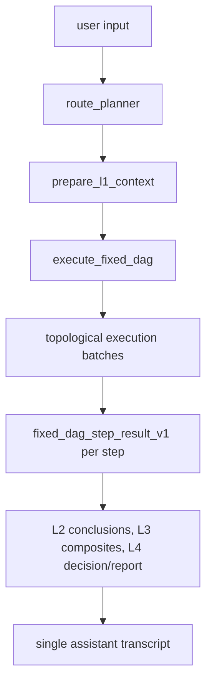

# Fixed DAG Architecture

This document describes the active reset skeleton, the Phase R4-A fixed DAG
catalog source, the Phase R4-B runtime binding registry, the Phase R4-C legacy
registry boundary cleanup, the Phase R5-B1 frontend contract migration, and the
Phase R5-B2 workflow DAG inspector UI rewrite. The skeleton is deterministic,
provider-free, plan-driven, and backed by explicit catalog, binding, contract,
executor, and function seams. It is not a completed business analysis engine.

## Active Skeleton Flow

The formal reset roster has 27 agent ids. The DAG executor itself is
infrastructure and is not counted as an agent id.

The active catalog source is `config/fixed_dag/agent_catalog.json`, loaded and
validated by `src/react_agent/fixed_dag_catalog.py`. The source workbook
`新架构_固定DAG_最终分层级智能体表_v4_反馈修正版.xlsx` is retained as the
R4 baseline input.

The active runtime binding source is `config/fixed_dag/runtime_bindings.json`,
loaded and validated by `src/react_agent/fixed_dag_runtime_registry.py`. It maps
the same 27 target ids to deterministic seams, disabled external HTTP
candidates, or pending placeholders. The binding registry does not change the
DAG topology and does not enable external invocation.

## Target IDs

| target_id | runtime layer | dimension | role |
| --- | --- | --- | --- |
| route_planner | L1 | planning | fixed DAG plan seam |
| financial_data_service | L1 | evidence | financial data bundle seam |
| entity_relation_extractor | L1 | evidence | entity and relation extraction seam |
| value_traditional_valuation | L2 | value | traditional valuation conclusion |
| value_ml_valuation | L2 | value | ML valuation conclusion |
| value_meta_valuation | L2 | value | meta valuation conclusion |
| value_research_synthesis | L2 | value | analyst research synthesis conclusion |
| market_stock_technical | L2 | market | stock technical conclusion |
| market_fund_manager_behavior | L2 | market | fund manager behavior conclusion |
| market_ipo_investor_behavior | L2 | market | IPO investor behavior conclusion |
| market_capital_flow_chip | L2 | market | capital flow and chip conclusion |
| sentiment_company_radar | L2 | market | company sentiment conclusion |
| risk_crash | L2 | risk | crash risk conclusion |
| risk_financial_fraud | L2 | risk | financial fraud risk conclusion |
| risk_identification | L2 | risk | risk identification conclusion |
| risk_compliance_review | L2 | risk | compliance review conclusion |
| macro_analysis | L2 | macro | macro analysis conclusion |
| macro_commodity_pricing | L2 | macro | commodity pricing conclusion |
| macro_index_valuation | L2 | macro | index valuation conclusion |
| macro_sentiment | L2 | macro | macro sentiment conclusion |
| macro_industry_hotspot | L2 | macro | industry hotspot conclusion |
| value_composite | L3 | value | value dimension composite |
| market_composite | L3 | market | market dimension composite |
| risk_composite | L3 | risk | risk dimension composite |
| macro_composite | L3 | macro | macro dimension composite |
| decision_synthesizer | L4 | decision | integrated decision placeholder |
| report_generator | L4 | report | final report placeholder |

The company sentiment radar output route is `market_composite` only. Generic
event flags may still exist in conclusion contracts, but the radar is not a
direct `risk_composite` input in this v4 feedback-aligned roster.

## Execution Principles

- The DAG executor is infrastructure and is not counted as a target id.
- `fixed_dag_agent_catalog_v1` is the active roster/catalog source for reset
  backend projection.
- `fixed_dag_runtime_bindings_v1` is the active backend runtime binding
  metadata source. Catalog ids, runtime binding ids, and executor step agent ids
  must match exactly.
- `fixed_dag_plan_v1.dag_steps[].depends_on` is the executor input.
- `validate_dag_steps` checks unique ids, dependency existence, acyclicity,
  stage/dimension legality, roster membership, and dimension dependency rules.
- `topological_batches` groups ready steps into deterministic
  `execution_batches`.
- Each walked step records a `fixed_dag_step_result_v1` placeholder annotated
  with binding metadata such as runtime kind and implementation status.
- The executor output is `fixed_dag_execution_v1` and feeds
  `workflow_snapshot_v2`.
- L1 prepares the plan, entity/relation bundle, and financial data bundle through
  deterministic constructors and validators.
- L2 produces normalized pending conclusion objects with `as_of`, `data_as_of`,
  optional generic `event_flags`, and no live invocation claims.
- L3 produces deterministic dimension composite placeholders. Value and market
  are direction-vote seams, risk is a gate seam, and macro is a regulator seam.
- L4 produces deterministic decision and report placeholders with stable fields.
- Public output remains a single assistant answer.
- R3 placeholders use `status=pending_implementation` until real business
  implementations replace them.
- R4-A owns the fixed DAG catalog source and `/api/agents` public projection.
- R4-B owns the runtime binding registry and offline external endpoint mapping
  metadata.
- R4-C owns active import boundary cleanup: legacy `AGENT_METADATA`,
  `AGENT_TOOLS`, placeholder bootstrap, and `config/agents` metadata are
  explicit compatibility/migration inputs, not active fixed-DAG runtime truth.
- Active `react_agent.graph` imports must not load `legacy_agent_registry`,
  `graph_bootstrap`, default agents, generic agents, or external HTTP wrapper
  implementation modules.
- R5-B1 owns frontend contract alignment with `workflow_snapshot_v2`.
- R5-B2 owns frontend workflow inspector rendering over the same public
  snapshot.
- R6 owns mainline/fusion-gate rebuild.
