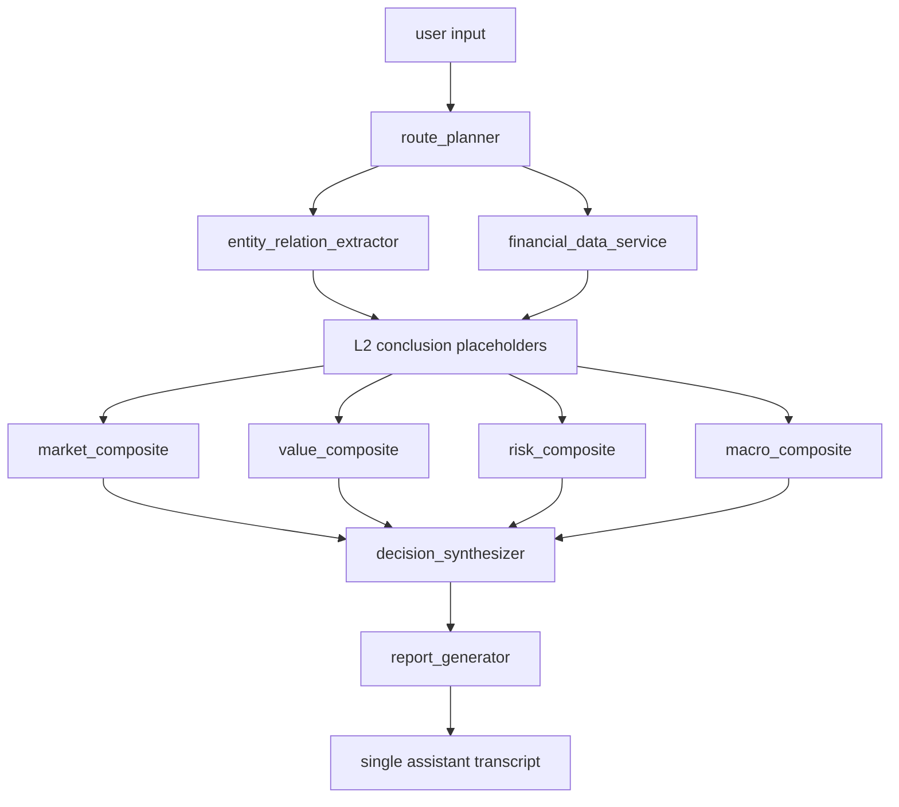

# Fixed DAG Architecture

This document describes the active Phase R1-B reset skeleton. The skeleton is
deterministic and provider-free. It is not a completed business analysis engine.

## Active Skeleton Flow

The formal reset roster has 27 agent ids. The DAG executor itself is
infrastructure and is not counted as an agent id.

## Target IDs

| target_id | runtime layer | dimension | role |
| --- | --- | --- | --- |
| route_planner | L1 | planning | fixed DAG plan seam |
| entity_relation_extractor | L1 | evidence | entity and relation extraction seam |
| financial_data_service | L1 | evidence | financial data bundle seam |
| value_traditional_valuation | L2 | value | traditional valuation conclusion |
| value_ml_valuation | L2 | value | ML valuation conclusion |
| value_meta_valuation | L2 | value | meta valuation conclusion |
| value_research_synthesis | L2 | value | analyst research synthesis conclusion |
| market_stock_technical | L2 | market | stock technical conclusion |
| market_fund_manager_behavior | L2 | market | fund manager behavior conclusion |
| market_ipo_investor_behavior | L2 | market | IPO investor behavior conclusion |
| market_capital_flow_chip | L2 | market | capital flow and chip conclusion |
| sentiment_company_radar | L2 | market | company sentiment conclusion |
| risk_crash | L2 | risk | crash risk conclusion |
| risk_financial_fraud | L2 | risk | financial fraud risk conclusion |
| risk_identification | L2 | risk | risk identification conclusion |
| risk_compliance_review | L2 | risk | compliance review conclusion |
| macro_analysis | L2 | macro | macro analysis conclusion |
| macro_commodity_pricing | L2 | macro | commodity pricing conclusion |
| macro_index_valuation | L2 | macro | index valuation conclusion |
| macro_sentiment | L2 | macro | macro sentiment conclusion |
| macro_industry_hotspot | L2 | macro | industry hotspot conclusion |
| value_composite | L3 | value | value dimension composite |
| market_composite | L3 | market | market dimension composite |
| risk_composite | L3 | risk | risk dimension composite |
| macro_composite | L3 | macro | macro dimension composite |
| decision_synthesizer | L4 | decision | integrated decision placeholder |
| report_generator | L4 | report | final report placeholder |

The company sentiment radar output route is `market_composite` only. Generic
event flags may still exist in conclusion contracts, but the radar is not a
direct `risk_composite` input in this v4 feedback-aligned roster.

## Execution Principles

- The DAG executor is infrastructure and is not counted as a target id.
- L1 prepares the plan, entity/relation bundle, and financial data bundle.
- L2 produces normalized conclusion objects.
- L3 produces deterministic dimension composite placeholders.
- L4 produces a deterministic decision placeholder and report placeholder.
- Public output remains a single assistant answer.
- R1-B placeholders use `status=pending_implementation` until real business
  implementations replace them.
