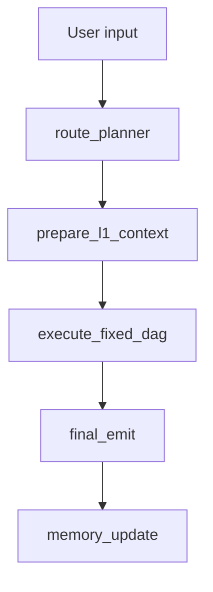

# System Map

This file is the reset branch operational map for Phase R5-C.

## Phase

- Current branch: `reset/fixed-dag-v1`.
- Current phase: R5-C frontend product polish and user-facing simplification
  over the existing R5-B2/R5-B2.6 workflow DAG inspector.
- Current runtime milestone: R3 plan-driven fixed DAG execution orchestration.
- Phase purpose: replace the active old Router/Manager/Fair-Fusion protocol with
  a deterministic provider-free fixed DAG skeleton whose execution order is
  derived from validated `dag_steps[].depends_on` and whose payloads are built
  by explicit constructors, normalizers, validators, and executor seams.
- Pre-reset history tag: `pre-fixed-dag-reset-20260604-1457`.
- R4 roster baseline input:
  `新架构_固定DAG_最终分层级智能体表_v4_反馈修正版.xlsx`.
- Active backend catalog source:
  `config/fixed_dag/agent_catalog.json`.
- Active backend runtime binding source:
  `config/fixed_dag/runtime_bindings.json`.
- Active frontend contract:
  `apps/web` renders the fixed DAG workflow inspector from
  `workflow_snapshot_v2` stage, step, dimension, batch, result, provenance, and
  `reset_skeleton` source fields, with localized Chinese visible copy, reduced
  default engineering/status noise, and raw technical ids/enum values retained
  in expanded details where needed for debugging.

## Current Runtime Entry

The executable graph is:

```text
langgraph.json
  -> src/react_agent/graph.py:graph
```

The public path is:

```text
apps/web
  -> src/react_agent/public_api.py
  -> src/react_agent/public_runtime.py
  -> src/react_agent/graph.py
```

The Python public adapter now projects `workflow_snapshot_v2`. The web UI shell
has R5-B1 contract migration, R5-B2 workflow inspector rendering, and R5-B2.6
Chinese visible-copy polish in place. R5-C adds user-facing simplification over
the same public payload.

The public `/api/agents` path now projects the fixed DAG catalog's 27
`snake_case` reset agents through the existing `AgentCatalogResponse` shape.
R4-B does not add binding fields to `/api/agents`.

## Active Fixed DAG Skeleton



Active skeleton properties:

- No provider call.
- No search call.
- No external `/v1/agent/invoke` call.
- No A01 contract consumption.
- No mode-based Manager dispatch.
- No Fair Fusion or baseline sidecar active graph branch.
- Final public source is `reset_skeleton`.
- Plan, bundle, conclusion, composite, decision, report, workflow, and final
  emit payloads are generated from `fixed_dag_contracts.py` seams.
- `execute_fixed_dag` validates dependencies, produces `execution_batches`, and
  records per-step `step_results`.
- R4-B annotates `step_results` with runtime binding metadata. This metadata
  is registry evidence only and does not trigger provider or external calls.
- R4-C isolates legacy aNN registry/bootstrap so active `react_agent.graph`
  imports do not register `AGENT_TOOLS`, default placeholders, generic agents,
  or external wrapper tools.
- Invalid plans fail soft to the deterministic default plan and surface degraded
  fallback provenance in the workflow snapshot.

## Retained But Inactive Infrastructure

R3/R4-C keeps these files and some old helper functions for later phases or
compatibility, but they are not active graph invocation authority:

- `src/react_agent/baseline_sidecar.py`
- `src/react_agent/legacy_agent_registry.py`
- `src/react_agent/graph_bootstrap.py`
- `src/react_agent/external_http_config.py`
- `src/react_agent/external_http_agents.py`
- `config/agents/*.json`
- `apps/web` screenshot/demo helper infrastructure, now refreshed to use the
  fixed DAG v2 fixture but not executed as part of reset runtime validation

In R4-C, `config/agents/*.json` and the legacy external wrapper table are
retained as adapter/migration inputs. They are not the active reset public
catalog or runtime registry truth, and wrapper mapping is not live service
verification. The old valuation-only facade and unused JSON helper were removed
after tests migrated to the generic external HTTP wrapper and no source/test
references remained.

## Target Fixed DAG IDs

The reset skeleton has 27 formal agent ids:

- L1: 3
- L2: 18
- L3: 4
- L4: 2

See `docs/ARCHITECTURE_FIXED_DAG.md`.

The v4 feedback-aligned roster removes the enterprise financial analysis target.
`sentiment_company_radar` is a market-dimension L2 agent and does not route
directly to `risk_composite`.

## Deleted Old-Lineage Boundary

R1-A removed:

- old Agent Catalog v2 docs and runbooks
- old mainline audit snapshots
- old route-prior/RARP helper source and regression bundle
- old Router-SFT tools, regression bundle, data, and requirements
- old A01 SFT data and train/eval tooling
- archive docs and archive tests
- old external-agent scaffold package

Historical recovery is through the pre-reset tag, not through current docs.

## Historical R3.6 Cleanup Boundary

R3.6 removed only high-confidence dead local artifacts and legacy fixtures that
were not active entry points. It also committed the v4 feedback workbook as an
R4 input.

R3.6 did not delete or migrate:

- `config/agents/*.json`
- external HTTP wrapper production code
- `apps/web` workflow implementation, except explicit legacy local-reference
  fixtures
- `src/react_agent/baseline_sidecar.py`
- `ops/regression/fusion/**`
- `ops/regression/provider/out/**`
- `assets/reference/**`
- `log/**`, `tmp/**`, or `outputs/benchmarks/**`

## Deferred

Later phases own:

- real business agent algorithms
- later replacement/removal policy for `config/agents/*.json`
- external service readiness and protocol repair
- R6 rebuilt mainline and fusion-gate quality gates
- richer visual dependency graph beyond ordered execution batches
- evidence-specific frontend drilldown once backend public evidence payloads
  are formalized
- production deployment, auth, HTTPS, observability, persistence, and rate limits

## Quality Entry Points

Safe R5-B2/R5-B2.6 validation commands:

```powershell
conda run --no-capture-output -n cline_env python -m ruff check src/react_agent tests scripts/quality
conda run --no-capture-output -n cline_env python -m pytest tests/unit_tests
conda run --no-capture-output -n cline_env python -m pytest tests/integration_tests/test_public_api.py
conda run --no-capture-output -n cline_env python -m pytest tests/integration_tests/test_graph.py
conda run --no-capture-output -n cline_env python scripts/quality/run_quality.py --mode static
npm --prefix apps/web run test
npm --prefix apps/web exec -- tsc --noEmit --project apps/web/tsconfig.json
npm --prefix apps/web run build -- --outDir E:/muti-agent/_tmp_web_build_r5b26
```

Do not run provider smoke, external live invoke, demo stack commands, or
artifact-writing mainline/fusion gates unless a later phase explicitly owns
them.

## Non-Claims

R3/R4/R5-B1/R5-B2/R5-B2.6 do not claim:

- business-agent correctness
- provider readiness
- external service readiness
- mainline/fusion-gate reset gate completion
- production deployment readiness

R4-C additionally does not claim that external HTTP candidates are enabled,
live verified, or ready for production invocation. It only claims the legacy
registry/bootstrap is isolated from the active fixed-DAG graph import path.

R5-B2 additionally does not claim a visual dependency graph beyond ordered
execution batches, evidence-specific drilldown, production deployment, or live
external readiness. It only claims frontend inspector rendering over the
current public fixed DAG payload.

R5-B2.6/R5-C additionally do not claim a runtime locale switch, schema change,
topology change, roster change, provider/external readiness, or production
readiness. R5-B2.6 only claims Chinese visible-copy localization and visual
copy polish; R5-C only claims normal-UI simplification and advanced diagnostic
disclosure cleanup over the same fixed DAG public payload.
