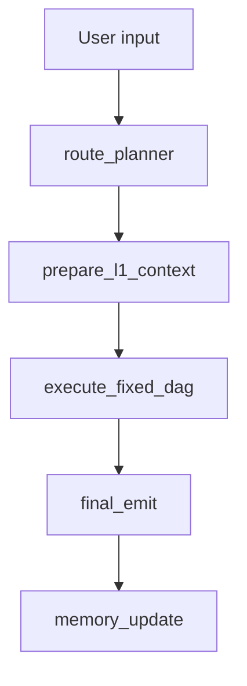

# System Map

This file is the current operational map for the fixed-DAG reset branch after
the Repository Authority & Active-Core Consolidation closeout. Phase names in
lower sections are provenance notes only; current status lives in
`docs/CURRENT_STATUS.md`, and the consolidation closeout is recorded in
`docs/REPOSITORY_CONSOLIDATION_CLOSEOUT.md`.

## Current Operating Status

- Branch: `reset/fixed-dag-v1`.
- Runtime entry: `langgraph.json -> src/react_agent/graph.py:graph`.
- Active backend catalog source: `config/fixed_dag/agent_catalog.json`.
- Active backend runtime binding source: `config/fixed_dag/runtime_bindings.json`.
- Public workflow contract: `workflow_snapshot_v2`.
- L4 runtime default: compute-only external defaults for `decision_synthesizer`
  and `report_generator`; this is not an `/invoke` path.
- Non-L4 production compute policy:
  `config/fixed_dag/non_l4_external_compute_policy.json` is
  `enabled_by_default=true` and separate from runtime bindings. It is
  `/v1/agent/compute` only. Required enabled ids are
  `value_traditional_valuation`, `value_ml_valuation`,
  `value_meta_valuation`, `market_ipo_investor_behavior`,
  `market_capital_flow_chip`, `risk_crash`, `macro_analysis`,
  `macro_index_valuation`, and `value_composite`; optional enabled RQ3A
  coverage rows are `value_research_synthesis`, `market_stock_technical`,
  `sentiment_company_radar`, `risk_financial_fraud`,
  `risk_identification`, `risk_compliance_review`,
  `macro_commodity_pricing`, `market_composite`, `risk_composite`, and
  `macro_composite`.
- Bidirectional sync workflow: strict non-zero publish-and-rebase has been
  verified; future cycles use exact experiment/change-unit/approval contracts.
- Current repository phase: post-consolidation normal maintenance / product
  engineering.
- Repository consolidation status: complete; see
  `docs/REPOSITORY_CONSOLIDATION_CLOSEOUT.md`.
- Current status entry point: `docs/CURRENT_STATUS.md`.
- Pre-reset history tag: `pre-fixed-dag-reset-20260604-1457`.

## Current Runtime Entry

The executable graph is:

```text
langgraph.json
  -> src/react_agent/graph.py:graph
```

The public path is:

```text
apps/web
  -> src/react_agent/public_api.py
  -> src/react_agent/public_runtime.py
  -> src/react_agent/graph.py
```

The Python public adapter now projects `workflow_snapshot_v2`. The web UI shell
has R5-B1 contract migration, R5-B2 workflow inspector rendering, and R5-B2.6
Chinese visible-copy polish in place. R5-C adds user-facing simplification over
the same public payload. R5-C1 removes remaining default-surface implementation
wording such as fixture/roster/transcript/path-wiring explanations. R7-I adds a
collapsed report-first thought-chain disclosure as the default workflow surface,
with the technical WorkflowPanel kept behind a secondary disclosure and still
consuming the same public payload.

The public `/api/agents` path now projects the fixed DAG catalog's 27
`snake_case` reset agents through the existing `AgentCatalogResponse` shape.
R4-B does not add binding fields to `/api/agents`.

R8-7B does not change frontend rendering, active graph execution, or the public
workflow schema. The default public path still receives
the full default `workflow_snapshot_v2` produced from the active fixed DAG
skeleton. When selected routing is explicitly enabled, the same public workflow
contract can project selected DAG steps and selected dimension groups. Router
M1A adds public-safe selected-routing provenance summary fields to that
workflow payload: `selectedRoutingRequested`, `selectedRoutingFallback`,
`fallbackReason`, `routeGranularity`, `selectedDimensions`, and
`expandedAgentCount`.

R8-6B keeps the default path provider-free and external-free. If
`ENABLE_INTERNAL_LLM_PLACEHOLDERS=1` is explicitly enabled, only L2 conclusions
may use the main-system model for bounded internal placeholder text. Provider
missing, provider configuration errors, parse failures, or unsafe content fall
back to deterministic pending conclusions. The graph still does not call any
external `/v1/agent/invoke` service.

R8-7B keeps that runtime boundary. The new external adapter module maps
`agent_conclusion_v1` to `conclusion_object_v1` and `data_bundle_v1` to the
current internal `data_bundle_v1` in provider-free unit tests only. It does not
perform HTTP, does not call `/health`, `/v1/agent/compute`, or
`/v1/agent/invoke`, does not change `runtime_bindings.json`, and does not set
`live_verified` or `invoke_enabled_by_default`.

R8-12 adds a separate demo bridge in
`src/react_agent/fixed_dag_external_compute_bridge.py`. The bridge is only
used by `execute_fixed_dag_plan` when `enable_external_compute_demo` is true
and an allowlist contains fixed DAG agent ids. It only accepts
`http://127.0.0.1:<prod_port>/v1/agent/compute` entries from the demo registry,
rejects `/v1/agent/invoke`, maps responses through
`fixed_dag_external_adapter.py`, and stores only bounded mapped contracts plus
public-safe workflow/report summaries. It is not `runtime_bindings.json`
authority, not live verification, and not default graph invocation.
The same pure adapter is also used by the source-controlled production
compute-only path; RQ3B keeps risk-branch failures honest by allowing
`risk_composite` to map as partial only when non-contributing risk members are
excluded from `contributing_agents` and retained as coverage limitations. RQ3C
adds the matching evidence-reference cleanup so refs pointing at those
non-contributors are dropped from mapped `risk_composite` evidence and recorded
only as coverage-limit metadata.

R8-4 did not change public workflow projection or frontend rendering. The
public path still receives the full default `workflow_snapshot_v2` produced from
the active fixed DAG skeleton. Selected route-intent planning and selected plan
compilation remain internal contract/compiler seams until a later runtime phase
intentionally connects them. RouteEval is an offline fixture/unit-test surface,
not a public workflow contract.

## Active Fixed DAG Skeleton



Active skeleton properties:

- No provider call on the default path.
- No search call.
- No external `/v1/agent/invoke` call.
- Non-L4 production compute may overlay approved `/v1/agent/compute` results
  from the source-controlled non-L4 policy when not disabled by rollback
  context. This is separate from `runtime_bindings.json` and is not `/invoke`
  evidence.
- L4 may call production-source `/v1/agent/compute` by default through the
  approved R8-13Q `external_compute_default` bindings for
  `decision_synthesizer` and `report_generator`; this can be disabled with
  `disable_external_compute_default` / `DISABLE_EXTERNAL_COMPUTE_DEFAULT=1`.
- No A01 contract consumption.
- No mode-based Manager dispatch.
- No Fair Fusion or baseline sidecar active graph branch.
- Final public source is `reset_skeleton`.
- Plan, bundle, conclusion, composite, decision, report, workflow, and final
  emit payloads are generated from `fixed_dag_contracts.py` seams.
- `route_planner` still builds the default full `fixed_dag_plan_v1` unless
  `Context.enable_selected_routing` / `ENABLE_SELECTED_ROUTING=1` is explicitly
  enabled. When enabled in M1A, route planning is internal and dimension-only:
  only `value`, `market`, `risk`, and `macro` may be selected by planner
  intent, and concrete agents are expanded deterministically by the compiler.
- `execute_fixed_dag` validates dependencies, produces `execution_batches`, and
  records per-step `step_results`.
- `execute_fixed_dag` may use internal LLM placeholders for L2 conclusions only
  when `Context.enable_internal_llm_placeholders` /
  `ENABLE_INTERNAL_LLM_PLACEHOLDERS=1` is explicitly enabled. Provider failures
  fail soft to deterministic pending conclusions.
- `fixed_dag_external_adapter.py` is active only for approved compute mappings:
  the default-off demo bridge, the production non-L4 compute overlay, and the
  R8-13Q L4 `external_compute_default` path. It is still not an `/invoke`
  client and it rejects unsafe public payload material.
- R4-B annotates `step_results` with runtime binding metadata. This metadata
  is registry evidence only and does not trigger provider or external calls.
- R4-C isolates legacy aNN registry/bootstrap so active `react_agent.graph`
  imports do not register `AGENT_TOOLS`, default placeholders, generic agents,
  or external wrapper tools.
- Invalid plans fail soft to the deterministic default plan and surface degraded
  fallback provenance in the workflow snapshot.
- M1A creates no external `route_planner` service, assigns no
  `route_planner` port, leaves `10028/8028` as planning-only reservation, and
  preserves `report_generator` on production compute port `10026`.

## Retained But Inactive Infrastructure

R3/R4-C keeps these files and some old helper functions for later phases or
compatibility, but they are not active graph invocation authority:

- `src/react_agent/baseline_sidecar.py`
- `src/react_agent/legacy_agent_registry.py`
- `src/react_agent/graph_bootstrap.py`
- `src/react_agent/external_http_config.py`
- `src/react_agent/external_http_agents.py`
- `config/agents/*.json`
- `apps/web` screenshot/demo helper infrastructure, now refreshed to use the
  fixed DAG v2 fixture but not executed as part of reset runtime validation

In R4-C, `config/agents/*.json` and the legacy external wrapper table are
retained as adapter/migration inputs. They are not the active reset public
catalog or runtime registry truth, and wrapper mapping is not live service
verification. The old valuation-only facade and unused JSON helper were removed
after tests migrated to the generic external HTTP wrapper and no source/test
references remained.

In R7-G, the scaffold package patches the v2.3.1 payload semantics and
validators. In R7-H, the local repo-external distribution working copy is
restored from the tracked mirror when missing, and frontend fixtures are
realigned with backend runtime binding literals. The package defines how later
service submissions should be reviewed against fixed DAG ids, runtime bindings,
contracts, and readiness levels. It does not register any service into the
graph, does not modify runtime bindings, and does not make wrapper metadata a
live verification signal.

In R7-I, the web shell adds the "研判思维链" presentation disclosure. It maps
`workflow_snapshot_v2` to six user-facing stages, current-stage summary,
four-dimension process signals, and safe provenance text. These dimension
signals are workflow-stage-derived presentation signals, not business-agent
conclusions, live market data, investment advice, confidence scores, or external
service results. It does not register agents, change runtime bindings, invoke
providers/search/external services, or expose hidden chain-of-thought.

In R8-1, `route_intent_v1` and `selected_fixed_dag_plan_v1` are added as
contract-only preparation for controlled dynamic routing. A route intent is
planner intent, not an executable DAG. A selected plan is a future deterministic
compiler output target that can explicitly omit dimensions and agents while
keeping full-DAG fallback metadata. R8-1 does not add an LLM planner, selected
DAG compiler, RouteEval, external adapter, public contract field, or runtime
binding change.

In R8-2, `compile_selected_fixed_dag_plan` deterministically compiles valid
`route_intent_v1` into dependency-closed `selected_fixed_dag_plan_v1` objects.
The compiler adds fixed L1/evidence seams, selected L2 agents, selected
dimension composites, policy-gated `decision_synthesizer`, and
`report_generator` without calling an LLM, provider, search backend, or external
service. `validate_selected_dag_steps` and
`topological_batches_for_selected_plan` validate and batch selected plans
without requiring the full 27-agent DAG. R8-2 still does not change `graph.py`,
public workflow mapping, frontend rendering, runtime bindings, RouteEval, or
external adapter readiness.

In R8-3, the route planner seam can produce `route_intent_v1` without invoking
a provider. `build_default_route_intent` is deterministic/mock planner output,
`FIXED_DAG_ROUTE_INTENT_SYSTEM_PROMPT` and `build_route_intent_prompt` define a
future LLM/semantic planner contract, and `parse_route_intent_json` plus
`normalize_route_intent` convert raw JSON-like planner output into route intent
or a safe clarification/fallback intent. R8-3 did not change `graph.py`, public
workflow mapping, frontend rendering, runtime bindings, or external adapter
readiness.

In R8-4, RouteEval evaluates `route_intent_v1` selection quality before active
selected routing is enabled. `load_route_eval_cases`,
`evaluate_route_intents`, and `route_eval_report_to_dict` load local JSONL gold
cases and report task type, target, dimension, agent, clarification, fallback,
over-selection, and under-selection metrics. The first fixture is small and
deterministic, not the future formal >=80% Route F1 acceptance set. R8-4 does
not evaluate Star/Chain/Debate/Tree modes, does not call providers/search or
external `/v1/agent/invoke`, and does not change `graph.py`, public workflow
mapping, frontend rendering, runtime bindings, or external adapter readiness.

In R8-5, selected routing is connected to `route_planner_node` behind an
explicit default-off graph boundary. The selected path uses
`build_default_route_intent` and `compile_selected_fixed_dag_plan`, then runs
through selected executor validation and selected topological batches. Selected
execution emits selected step results, selected L2 conclusions, selected
dimension composites, and a selected-subset `workflow_snapshot_v2`. The default
graph path remains the full DAG. Selected compile/validation failures fall back
to the full DAG with public-safe provenance. R8-5 still does not call an
LLM/provider, search backend, external `/v1/agent/invoke`, runtime binding
adapter, or real business agent.

In R8-6B, `execute_fixed_dag_plan` can build L2 conclusions through
`src/react_agent/fixed_dag_llm_placeholders.py` when
`Context.enable_internal_llm_placeholders` /
`ENABLE_INTERNAL_LLM_PLACEHOLDERS=1` is explicitly enabled. The module prompts
the main-system model for bounded JSON placeholder content, parses and sanitizes
the result, clamps confidence to `<=0.4`, marks provenance as
`runtime_path=internal_llm_placeholder`, and falls back to the deterministic
pending conclusion on provider or parser failure. This is an internal placeholder
only: L3 composites, L4 decision synthesis, and report generation remain
deterministic, no external agent is invoked, and no runtime binding is enabled.

In R8-7B, `src/react_agent/fixed_dag_external_adapter.py` maps supported
external payload dictionaries into current internal fixed-DAG contracts without
calling HTTP, providers, or server agents. The first implementation slice covers
`agent_conclusion_v1 -> conclusion_object_v1` and
`data_bundle_v1 -> data_bundle_v1`; unsupported payload families return
controlled adapter failures or remain future work. This does not wire external
payloads into `execute_fixed_dag_plan`, does not modify runtime bindings, and
does not imply live readiness for deployed services.

## Deployed But Deferred Inventory

R8-6B records server-deployed-but-deferred agent evidence in
`docs/DEPLOYED_AGENT_INVENTORY_DEFERRED.md`. This inventory is documentation
evidence only. Directory presence and listening processes do not equal health
verification; health verification does not equal compute/invoke verification;
compute/invoke verification does not equal `live_verified=true`; and
`live_verified=true` does not equal `invoke_enabled_by_default=true`.

Runtime authority remains in `config/fixed_dag/agent_catalog.json`,
`config/fixed_dag/runtime_bindings.json`, and the fixed-DAG validators. R8-7B
does not modify runtime bindings, set `live_verified=true`, set
`invoke_enabled_by_default=true`, or enable external service invocation.

## Target Fixed DAG IDs

The reset skeleton has 27 formal agent ids:

- L1: 3
- L2: 18
- L3: 4
- L4: 2

See `docs/ARCHITECTURE_FIXED_DAG.md`.

The v4 feedback-aligned roster removes the enterprise financial analysis target.
`sentiment_company_radar` is a market-dimension L2 agent and does not route
directly to `risk_composite`.

## Historical Deleted Old-Lineage Boundary

R1-A removed:

- old Agent Catalog v2 docs and runbooks
- old mainline audit snapshots
- old route-prior/RARP helper source and regression bundle
- old Router-SFT tools, regression bundle, data, and requirements
- old A01 SFT data and train/eval tooling
- archive docs and archive tests
- old external-agent scaffold package

Historical recovery is through the pre-reset tag, not through current docs.

## Historical R3.6 Cleanup Boundary

R3.6 removed only high-confidence dead local artifacts and legacy fixtures that
were not active entry points. It also committed the v4 feedback workbook as an
R4 input.

R3.6 did not delete or migrate:

- `config/agents/*.json`
- external HTTP wrapper production code
- `apps/web` workflow implementation, except explicit legacy local-reference
  fixtures
- `src/react_agent/baseline_sidecar.py`
- `ops/regression/fusion/**`
- `ops/regression/provider/out/**`
- `assets/reference/**`
- generated `log/**`, `tmp/**`, or `outputs/benchmarks/**` artifacts; these
  have been removed from the reset branch and should stay untracked

## Historical Deferred Items

Later phases own:

- real business agent algorithms
- conversion of approved external services into runtime adapter code
- later replacement/removal policy for `config/agents/*.json`
- external service readiness and protocol repair
- archived/manual fusion-gate policy and any later fusion acceptance rebuild
- larger RouteEval gold set and formal route-quality threshold
- richer visual dependency graph beyond ordered execution batches
- evidence-specific frontend drilldown once backend public evidence payloads
  are formalized
- production deployment, auth, HTTPS, observability, persistence, and rate limits

## Quality Entry Points

R6-B rebuilds the default reset mainline quality gate:

```powershell
conda run --no-capture-output -n cline_env python scripts/quality/run_quality.py --mode static
conda run --no-capture-output -n cline_env python scripts/quality/run_quality.py --mode unit
conda run --no-capture-output -n cline_env python scripts/quality/run_quality.py --mode public-api
conda run --no-capture-output -n cline_env python scripts/quality/run_quality.py --mode graph-smoke
conda run --no-capture-output -n cline_env python scripts/quality/run_quality.py --mode frontend
conda run --no-capture-output -n cline_env python scripts/quality/run_quality.py --mode mainline
```

The reset `mainline` runs static, unit, public-api, graph-smoke, and frontend.
The frontend mode performs TypeScript no-emit, frontend smoke, and Vite build
with a temporary repo-external `--outDir`; it must not write `apps/web/dist`.

R7-H restores `E:\muti-agent\external_agent_scaffold` from
`examples/fixed_dag_external_agent_scaffold/` when the local distribution
working copy is missing. Validation can then run repo-external scaffold tests
and ruff for `E:\muti-agent\external_agent_scaffold`, repo mirror tests and
ruff for `examples/fixed_dag_external_agent_scaffold/`, and the same
non-provider `static` and `mainline` commands. It does not add provider,
external live invoke, demo stack, or fusion-gate acceptance to the default
reset gate.

Do not run provider smoke, external live invoke, demo stack commands,
Router-SFT, RARP/route-prior, browser screenshot capture, or archived
fusion-gate as default reset acceptance.

## Non-Claims

R3/R4/R5-B1/R5-B2/R5-B2.6/R5-C/R5-C1 do not claim:

- business-agent correctness
- provider readiness
- external service readiness
- production deployment readiness

R6-B claims only the rebuilt default reset mainline quality gate. It does not
claim provider readiness, external service readiness, production readiness,
visual screenshot acceptance, full-tree lint, or restored fusion acceptance.
`fusion-gate` remains archived/manual.

R7-G claims only external scaffold contract-package coverage across the repo
mirror, distribution working copy, fixed DAG docs, and changelog. R7-H claims
only consistency repair for frontend fixture metadata, documentation wording,
and local scaffold working-copy restoration. R7-I claims only a frontend
report-first thought-chain presentation disclosure. These phases do not change
fixed DAG topology, roster, runtime bindings, active runtime behavior, public
schemas, provider readiness, external invocation readiness, demo stack
acceptance, business-agent correctness, or production deployment readiness.

R4-C additionally does not claim that external HTTP candidates are enabled,
live verified, or ready for production invocation. It only claims the legacy
registry/bootstrap is isolated from the active fixed-DAG graph import path.

R5-B2 additionally does not claim a visual dependency graph beyond ordered
execution batches, evidence-specific drilldown, production deployment, or live
external readiness. It only claims frontend inspector rendering over the
current public fixed DAG payload.

R5-B2.6/R5-C/R5-C1 additionally do not claim a runtime locale switch, schema
change, topology change, roster change, provider/external readiness, or
production readiness. R5-B2.6 only claims Chinese visible-copy localization and
visual copy polish; R5-C only claims normal-UI simplification and advanced
diagnostic disclosure cleanup; R5-C1 only claims default user-facing business
copy professionalization over the same fixed DAG public payload.
