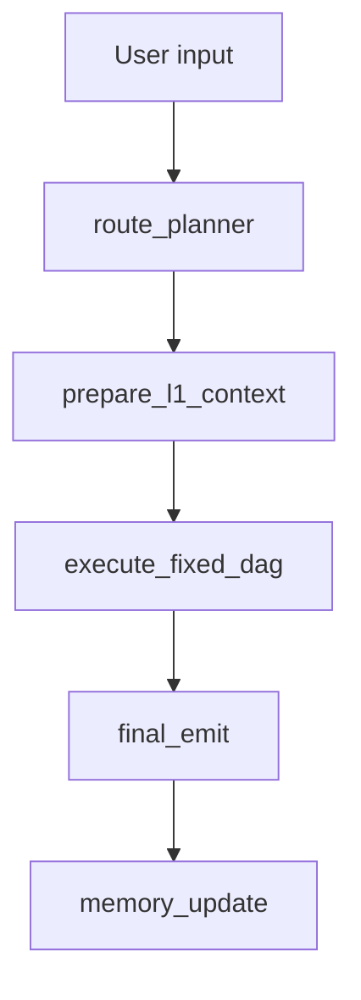

# System Map

This file is the reset branch operational map for Phase R7-I.

## Phase

- Current branch: `reset/fixed-dag-v1`.
- Current phase: R7-I report-first thought-chain presentation mode over the
  existing fixed-DAG runtime skeleton, R5 web shell, and R7-G v2.3.1 scaffold
  package.
- Current runtime milestone: R3 plan-driven fixed DAG execution orchestration.
- Phase purpose: replace the active old Router/Manager/Fair-Fusion protocol with
  a deterministic provider-free fixed DAG skeleton whose execution order is
  derived from validated `dag_steps[].depends_on` and whose payloads are built
  by explicit constructors, normalizers, validators, and executor seams.
- Pre-reset history tag: `pre-fixed-dag-reset-20260604-1457`.
- R4 roster baseline input:
  `新架构_固定DAG_最终分层级智能体表_v4_反馈修正版.xlsx`.
- Active backend catalog source:
  `config/fixed_dag/agent_catalog.json`.
- Active backend runtime binding source:
  `config/fixed_dag/runtime_bindings.json`.
- Active external developer handoff docs:
  `docs/EXTERNAL_AGENT_HANDOFF_FIXED_DAG.md`,
  `docs/EXTERNAL_AGENT_PAYLOAD_MAPPING_FIXED_DAG.md`,
  `docs/EXTERNAL_AGENT_READINESS_LADDER_FIXED_DAG.md`, and
  `docs/EXTERNAL_AGENT_SAMPLE_PAYLOADS_FIXED_DAG.md`.
- Repo-external scaffold distribution working copy restored from the tracked
  mirror when missing:
  `E:\muti-agent\external_agent_scaffold`.
- Tracked repo mirror and audit truth for that package:
  `examples/fixed_dag_external_agent_scaffold/`.
- Active frontend contract:
  `apps/web` renders the fixed DAG workflow inspector from
  `workflow_snapshot_v2` stage, step, dimension, batch, result, provenance, and
  `reset_skeleton` source fields, with localized Chinese visible copy, reduced
  default engineering/status noise, professional business-facing dimension,
  step, and answer-card evidence copy, and raw technical ids/enum values
  retained in expanded details where needed for debugging. R7-I adds a
  report-first "研判思维链" disclosure derived from the same public workflow
  snapshot; it is the normal user-facing workflow surface below the assistant
  report, not a backend runtime change or extra public agent lane. The full
  WorkflowPanel remains available as a technical inspector behind "技术流程详情".

## Current Runtime Entry

The executable graph is:

```text
langgraph.json
  -> src/react_agent/graph.py:graph
```

The public path is:

```text
apps/web
  -> src/react_agent/public_api.py
  -> src/react_agent/public_runtime.py
  -> src/react_agent/graph.py
```

The Python public adapter now projects `workflow_snapshot_v2`. The web UI shell
has R5-B1 contract migration, R5-B2 workflow inspector rendering, and R5-B2.6
Chinese visible-copy polish in place. R5-C adds user-facing simplification over
the same public payload. R5-C1 removes remaining default-surface implementation
wording such as fixture/roster/transcript/path-wiring explanations. R7-I adds a
collapsed report-first thought-chain disclosure as the default workflow surface,
with the technical WorkflowPanel kept behind a secondary disclosure and still
consuming the same public payload.

The public `/api/agents` path now projects the fixed DAG catalog's 27
`snake_case` reset agents through the existing `AgentCatalogResponse` shape.
R4-B does not add binding fields to `/api/agents`.

## Active Fixed DAG Skeleton



Active skeleton properties:

- No provider call.
- No search call.
- No external `/v1/agent/invoke` call.
- No A01 contract consumption.
- No mode-based Manager dispatch.
- No Fair Fusion or baseline sidecar active graph branch.
- Final public source is `reset_skeleton`.
- Plan, bundle, conclusion, composite, decision, report, workflow, and final
  emit payloads are generated from `fixed_dag_contracts.py` seams.
- `execute_fixed_dag` validates dependencies, produces `execution_batches`, and
  records per-step `step_results`.
- R4-B annotates `step_results` with runtime binding metadata. This metadata
  is registry evidence only and does not trigger provider or external calls.
- R4-C isolates legacy aNN registry/bootstrap so active `react_agent.graph`
  imports do not register `AGENT_TOOLS`, default placeholders, generic agents,
  or external wrapper tools.
- Invalid plans fail soft to the deterministic default plan and surface degraded
  fallback provenance in the workflow snapshot.

## Retained But Inactive Infrastructure

R3/R4-C keeps these files and some old helper functions for later phases or
compatibility, but they are not active graph invocation authority:

- `src/react_agent/baseline_sidecar.py`
- `src/react_agent/legacy_agent_registry.py`
- `src/react_agent/graph_bootstrap.py`
- `src/react_agent/external_http_config.py`
- `src/react_agent/external_http_agents.py`
- `config/agents/*.json`
- `apps/web` screenshot/demo helper infrastructure, now refreshed to use the
  fixed DAG v2 fixture but not executed as part of reset runtime validation

In R4-C, `config/agents/*.json` and the legacy external wrapper table are
retained as adapter/migration inputs. They are not the active reset public
catalog or runtime registry truth, and wrapper mapping is not live service
verification. The old valuation-only facade and unused JSON helper were removed
after tests migrated to the generic external HTTP wrapper and no source/test
references remained.

In R7-G, the scaffold package patches the v2.3.1 payload semantics and
validators. In R7-H, the local repo-external distribution working copy is
restored from the tracked mirror when missing, and frontend fixtures are
realigned with backend runtime binding literals. The package defines how later
service submissions should be reviewed against fixed DAG ids, runtime bindings,
contracts, and readiness levels. It does not register any service into the
graph, does not modify runtime bindings, and does not make wrapper metadata a
live verification signal.

In R7-I, the web shell adds the "研判思维链" presentation disclosure. It maps
`workflow_snapshot_v2` to six user-facing stages, current-stage summary,
four-dimension process signals, and safe provenance text. These dimension
signals are workflow-stage-derived presentation signals, not business-agent
conclusions, live market data, investment advice, confidence scores, or external
service results. It does not register agents, change runtime bindings, invoke
providers/search/external services, or expose hidden chain-of-thought.

## Target Fixed DAG IDs

The reset skeleton has 27 formal agent ids:

- L1: 3
- L2: 18
- L3: 4
- L4: 2

See `docs/ARCHITECTURE_FIXED_DAG.md`.

The v4 feedback-aligned roster removes the enterprise financial analysis target.
`sentiment_company_radar` is a market-dimension L2 agent and does not route
directly to `risk_composite`.

## Deleted Old-Lineage Boundary

R1-A removed:

- old Agent Catalog v2 docs and runbooks
- old mainline audit snapshots
- old route-prior/RARP helper source and regression bundle
- old Router-SFT tools, regression bundle, data, and requirements
- old A01 SFT data and train/eval tooling
- archive docs and archive tests
- old external-agent scaffold package

Historical recovery is through the pre-reset tag, not through current docs.

## Historical R3.6 Cleanup Boundary

R3.6 removed only high-confidence dead local artifacts and legacy fixtures that
were not active entry points. It also committed the v4 feedback workbook as an
R4 input.

R3.6 did not delete or migrate:

- `config/agents/*.json`
- external HTTP wrapper production code
- `apps/web` workflow implementation, except explicit legacy local-reference
  fixtures
- `src/react_agent/baseline_sidecar.py`
- `ops/regression/fusion/**`
- `ops/regression/provider/out/**`
- `assets/reference/**`
- generated `log/**`, `tmp/**`, or `outputs/benchmarks/**` artifacts; these
  have been removed from the reset branch and should stay untracked

## Deferred

Later phases own:

- real business agent algorithms
- conversion of approved external services into runtime adapter code
- later replacement/removal policy for `config/agents/*.json`
- external service readiness and protocol repair
- archived/manual fusion-gate policy and any later fusion acceptance rebuild
- richer visual dependency graph beyond ordered execution batches
- evidence-specific frontend drilldown once backend public evidence payloads
  are formalized
- production deployment, auth, HTTPS, observability, persistence, and rate limits

## Quality Entry Points

R6-B rebuilds the default reset mainline quality gate:

```powershell
conda run --no-capture-output -n cline_env python scripts/quality/run_quality.py --mode static
conda run --no-capture-output -n cline_env python scripts/quality/run_quality.py --mode unit
conda run --no-capture-output -n cline_env python scripts/quality/run_quality.py --mode public-api
conda run --no-capture-output -n cline_env python scripts/quality/run_quality.py --mode graph-smoke
conda run --no-capture-output -n cline_env python scripts/quality/run_quality.py --mode frontend
conda run --no-capture-output -n cline_env python scripts/quality/run_quality.py --mode mainline
```

The reset `mainline` runs static, unit, public-api, graph-smoke, and frontend.
The frontend mode performs TypeScript no-emit, frontend smoke, and Vite build
with a temporary repo-external `--outDir`; it must not write `apps/web/dist`.

R7-H restores `E:\muti-agent\external_agent_scaffold` from
`examples/fixed_dag_external_agent_scaffold/` when the local distribution
working copy is missing. Validation can then run repo-external scaffold tests
and ruff for `E:\muti-agent\external_agent_scaffold`, repo mirror tests and
ruff for `examples/fixed_dag_external_agent_scaffold/`, and the same
non-provider `static` and `mainline` commands. It does not add provider,
external live invoke, demo stack, or fusion-gate acceptance to the default
reset gate.

Do not run provider smoke, external live invoke, demo stack commands,
Router-SFT, RARP/route-prior, browser screenshot capture, or archived
fusion-gate as default reset acceptance.

## Non-Claims

R3/R4/R5-B1/R5-B2/R5-B2.6/R5-C/R5-C1 do not claim:

- business-agent correctness
- provider readiness
- external service readiness
- production deployment readiness

R6-B claims only the rebuilt default reset mainline quality gate. It does not
claim provider readiness, external service readiness, production readiness,
visual screenshot acceptance, full-tree lint, or restored fusion acceptance.
`fusion-gate` remains archived/manual.

R7-G claims only external scaffold contract-package coverage across the repo
mirror, distribution working copy, fixed DAG docs, and changelog. R7-H claims
only consistency repair for frontend fixture metadata, documentation wording,
and local scaffold working-copy restoration. R7-I claims only a frontend
report-first thought-chain presentation disclosure. These phases do not change
fixed DAG topology, roster, runtime bindings, active runtime behavior, public
schemas, provider readiness, external invocation readiness, demo stack
acceptance, business-agent correctness, or production deployment readiness.

R4-C additionally does not claim that external HTTP candidates are enabled,
live verified, or ready for production invocation. It only claims the legacy
registry/bootstrap is isolated from the active fixed-DAG graph import path.

R5-B2 additionally does not claim a visual dependency graph beyond ordered
execution batches, evidence-specific drilldown, production deployment, or live
external readiness. It only claims frontend inspector rendering over the
current public fixed DAG payload.

R5-B2.6/R5-C/R5-C1 additionally do not claim a runtime locale switch, schema
change, topology change, roster change, provider/external readiness, or
production readiness. R5-B2.6 only claims Chinese visible-copy localization and
visual copy polish; R5-C only claims normal-UI simplification and advanced
diagnostic disclosure cleanup; R5-C1 only claims default user-facing business
copy professionalization over the same fixed DAG public payload.
