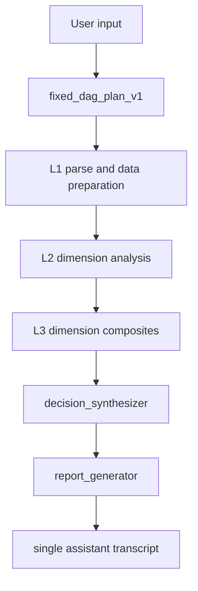

# System Map

This file is the reset branch operational map for Phase R1-A.

## Phase

- Current branch: `reset/fixed-dag-v1`.
- Current phase: R1-A hard slimming.
- Phase purpose: delete old lineage, rebuild minimal reset docs, and keep runtime untouched.
- Pre-reset history tag: `pre-fixed-dag-reset-20260604-1457`.

## Current Runtime Entry

The current executable graph remains:

```text
langgraph.json
  -> src/react_agent/graph.py:graph
```

The public path remains:

```text
apps/web
  -> src/react_agent/public_api.py
  -> src/react_agent/public_runtime.py
  -> src/react_agent/graph.py
```

This is a retained current boundary, not the new Fixed DAG runtime.

## Retained Runtime Files

R1-A intentionally keeps:

- `src/react_agent/graph.py`
- `src/react_agent/prompts.py`
- `src/react_agent/router_parse.py`
- `src/react_agent/state.py`
- `src/react_agent/public_contracts.py`
- `src/react_agent/public_mapping.py`
- `src/react_agent/public_api.py`
- `src/react_agent/public_runtime.py`
- `src/react_agent/public_store.py`
- `src/react_agent/public_guardrails.py`
- `src/react_agent/baseline_sidecar.py`
- `apps/web`

Mode prompt/parser/state fields, Fair Fusion sidecars, and current public workflow projection are deferred to later phases.

## Target Fixed DAG

The target architecture is:



The target formal agent set has 28 agents:

- L1: 3
- L2: 19
- L3: 4
- L4: 2

See `docs/ARCHITECTURE_FIXED_DAG.md`.

## Deleted Old-Lineage Boundary

R1-A removes:

- old Agent Catalog v2 docs and runbooks
- old mainline audit snapshots
- old route-prior/RARP helper source and regression bundle
- old Router-SFT tools, regression bundle, data, and requirements
- old A01 SFT data and train/eval tooling
- archive docs and archive tests
- old external-agent scaffold package

Historical recovery is through the pre-reset tag, not through current docs.

## Deferred

Later phases own:

- removal of route mode prompt/parser/state/public workflow concepts
- Fair Fusion and baseline sidecar removal or replacement
- Fixed DAG contract implementation
- graph skeleton rewrite
- snake_case catalog/runtime registry
- frontend DAG workflow inspector
- rebuilt mainline quality gate

## Quality Entry Points

Safe R1-A validation commands:

```powershell
conda run --no-capture-output -n cline_env python -m ruff check src/react_agent tests scripts/quality
conda run --no-capture-output -n cline_env python -m pytest tests/unit_tests
conda run --no-capture-output -n cline_env python -m pytest tests/integration_tests/test_public_api.py
conda run --no-capture-output -n cline_env python -m pytest tests/integration_tests/test_graph.py
conda run --no-capture-output -n cline_env python scripts/quality/run_quality.py --mode static
```

Do not run provider smoke, external live invoke, demo stack commands, or artifact-writing mainline/fusion gates unless a later phase explicitly owns them.

## Non-Claims

R1-A does not claim:

- Fixed DAG runtime completion
- frontend v2 completion
- provider readiness
- external service readiness
- production deployment readiness
