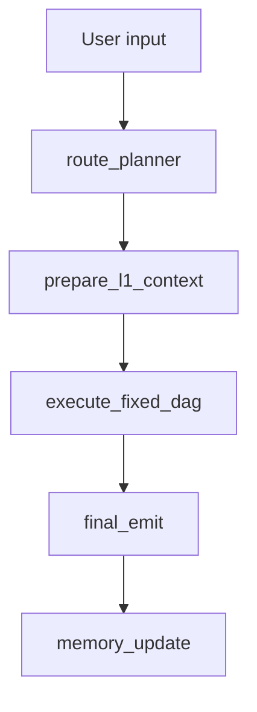

# System Map

This file is the reset branch operational map for Phase R3.

## Phase

- Current branch: `reset/fixed-dag-v1`.
- Current phase: R3 plan-driven fixed DAG execution orchestration.
- Phase purpose: replace the active old Router/Manager/Fair-Fusion protocol with
  a deterministic provider-free fixed DAG skeleton whose execution order is
  derived from validated `dag_steps[].depends_on` and whose payloads are built
  by explicit constructors, normalizers, validators, and executor seams.
- Pre-reset history tag: `pre-fixed-dag-reset-20260604-1457`.

## Current Runtime Entry

The executable graph is:

```text
langgraph.json
  -> src/react_agent/graph.py:graph
```

The public path is:

```text
apps/web
  -> src/react_agent/public_api.py
  -> src/react_agent/public_runtime.py
  -> src/react_agent/graph.py
```

The Python public adapter now projects `workflow_snapshot_v2`. The web UI shell
is retained and still needs the R5 workflow inspector rewrite.

## Active Fixed DAG Skeleton



Active skeleton properties:

- No provider call.
- No search call.
- No external `/v1/agent/invoke` call.
- No A01 contract consumption.
- No mode-based Manager dispatch.
- No Fair Fusion or baseline sidecar active graph branch.
- Final public source is `reset_skeleton`.
- Plan, bundle, conclusion, composite, decision, report, workflow, and final
  emit payloads are generated from `fixed_dag_contracts.py` seams.
- `execute_fixed_dag` validates dependencies, produces `execution_batches`, and
  records per-step `step_results`.
- Invalid plans fail soft to the deterministic default plan and surface degraded
  fallback provenance in the workflow snapshot.

## Retained But Inactive Infrastructure

R3 keeps these files and some old helper functions for later phases or
compatibility, but they are not active runtime authority:

- `src/react_agent/baseline_sidecar.py`
- `src/react_agent/external_http_agents.py`
- `src/react_agent/external_valuation_agents.py`
- `config/agents/*.json`
- `apps/web`

## Target Fixed DAG IDs

The reset skeleton has 27 formal agent ids:

- L1: 3
- L2: 18
- L3: 4
- L4: 2

See `docs/ARCHITECTURE_FIXED_DAG.md`.

The v4 feedback-aligned roster removes the enterprise financial analysis target.
`sentiment_company_radar` is a market-dimension L2 agent and does not route
directly to `risk_composite`.

## Deleted Old-Lineage Boundary

R1-A removed:

- old Agent Catalog v2 docs and runbooks
- old mainline audit snapshots
- old route-prior/RARP helper source and regression bundle
- old Router-SFT tools, regression bundle, data, and requirements
- old A01 SFT data and train/eval tooling
- archive docs and archive tests
- old external-agent scaffold package

Historical recovery is through the pre-reset tag, not through current docs.

## Deferred

Later phases own:

- real business agent algorithms
- R4 snake_case catalog/runtime registry replacement
- external service readiness and protocol repair
- R5 frontend DAG workflow inspector rewrite
- R6 rebuilt mainline and fusion-gate quality gates
- production deployment, auth, HTTPS, observability, persistence, and rate limits

## Quality Entry Points

Safe R3 validation commands:

```powershell
conda run --no-capture-output -n cline_env python -m ruff check src/react_agent tests scripts/quality
conda run --no-capture-output -n cline_env python -m pytest tests/unit_tests
conda run --no-capture-output -n cline_env python -m pytest tests/integration_tests/test_public_api.py
conda run --no-capture-output -n cline_env python -m pytest tests/integration_tests/test_graph.py
conda run --no-capture-output -n cline_env python scripts/quality/run_quality.py --mode static
```

Do not run provider smoke, external live invoke, demo stack commands, or
artifact-writing mainline/fusion gates unless a later phase explicitly owns
them.

## Non-Claims

R3 does not claim:

- frontend v2 completion
- business-agent correctness
- provider readiness
- external service readiness
- mainline/fusion-gate reset gate completion
- production deployment readiness
